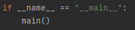
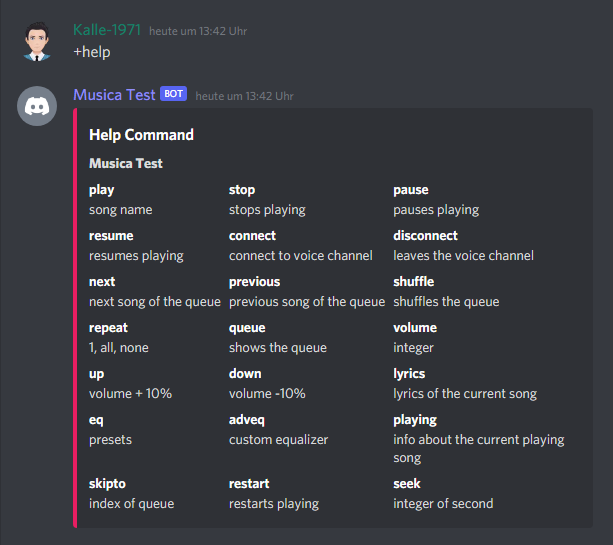

[](https://lbesson.mit-license.org/)



## Sample Commands



## Installation (Windows)
  1. Install Python > 3.8.5
```
https://www.python.org/downloads/release/python-385/
```
  1. Open CMD
```
cd /yourpath/sleath-musica-master
```
  2. Load project dependencies
```
python -m pip install -r requirements.txt
```
  3. Go to [Discord Developer Portal](https://discord.com/developers/applications) and create an Application and copy the Token
```
Go to /data and create a token.0 File and Paste the Token there.
```
  4. Run Lavalink (Important to Play Music)
```
java -jar Lavalink.jar
```
  5. Run the Bot
```
python launcher.py
```

## Installation on Linux (Coming Soon)

## Installation Lavalink
  1. Go to [Releases](https://github.com/freyacodes/Lavalink/releases) and Download the jar File
  2. Put the jar File into the Project Folder (sleath-musica)
  3. Test that you have the right JDK Version > 13.0.2
```
Java --version / java --version
```
  4. Download the right JDK Version [here](https://www.oracle.com/java/technologies/javase/jdk13-archive-downloads.html#license-lightbox) or start directly
```
Java -jar Lavalink.jar / java -jar Lavalink.jar
```
## Important

> !!! **You must have JDK >13.0.2** to use this project

> !!! Don't forget to run **java -jar Lavalink.jar** before everytime you start the Bot

## Made With

* Python: 3.8.5
* Lavalink 1260
* JDK 13.0.2

## Contact
For any problems, you can contact us with the Ticket System on the Website
*   Discord: [Sleath Development](https://dsc.gg/sleath-development)
*   Website: [Ticket](https://store.sleath-development.eu/index.php/support/)

## License
[APACHE 2.0](LICENSE.md)

## Powered by
[RobinIT](https://robin-it.de/)
